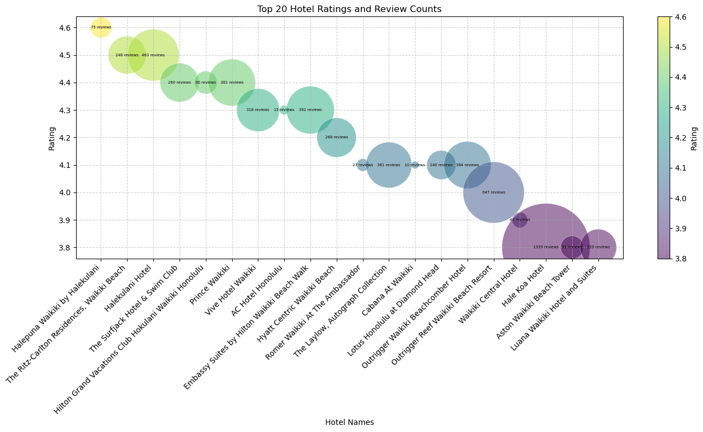

# AlohaVista
Our project is focused on creating a webpage that is a tourist guide for visiting Honolulu, Hawaii. We want to give users who visit our webpage the option to navigate the settings, stays, and attractions that Hawaii offers: hotels, restaurants, attractions (surfing spots, native Hawaii events, golf, water attractions), and weather.

We are going to use the Data Visualization Track which will consist of a webpage that consists of 4-5 different visualizations of the attractions that Hawaii has to offer (mentioned above: hotel, restaurants, attractions…). These visualizations will have a few parameters that include price and rating. Other additional parameters like hours of operation may be added. 

We’ll be using a combination of Python and Javascript to write our scripts and create notebooks. Additionally, MongoDB will be our database that will allow us to collect data for some of the static visualizations that we create. Dynamic API calls for interactive visualizations will come from a few of the following APIs.

__APIs:__ 
* https://myprojects.geoapify.com/projects
* https://openweathermap.org/api
* https://developer.ticketmaster.com/products-and-docs/apis/getting-started/
* https://docs.developer.yelp.com/docs/fusion-intro


•	The GitHub repo has a README.md that includes the following: (10 points)
o	An overview of the project and its purpose
o	Instructions on how to use and interact with the project
o	At least one paragraph summarizing efforts for ethical considerations made in the project
o	References for the data source(s)
o	References for any code used that is not your own

Imagine you are planning your first vacation to Hawai’i, and you know nothing about the island i.e. activities to do there, restaurants to dine at, best hotel to stay at. This project serves as a tour guide to anyone who is new to visiting the island. Our webpage AlohaVista has plenty of interactive tools to help you plan out your perfect vacation while sticking to a budget. 
The home page will give you a forecast of the weather details for upcoming days, so you know what clothes to pack. In the search bar type in Honolulu and you will see the weather forecast for the upcoming days. To maximize your dining experience, use the Dining tab to find the perfect restaurant for you which takes into consideration cuisine type, yelp rating, and price. Select from the dropdown menu the type of cuisine you’re interested in eating, and you will see a table underneath that shows the top 5 restaurants sorted in descending order by highest yelp rating. Click on the restaurant name to bring up restaurant details on the map. Utilize the hotels tab to find a nice hotel that is in your price range. Select from the drop-down menu the price that’s in your budget. Then select a marker on the map to bring up information about that hotel. Scroll to the bottom of the page to find out the best hotels by yelp rating and how they compare to others in the area. Check out our events page to discover any upcoming live entertainment in the area such as concerts and comedy shows. Click a date on the interactive calendar to see any live event information going on for that specific day. These events will pop up on the interactive map where you can also find out information on tourist activities. Click on any of the colorful markers to find out details on activities you’re interested in doing. Navigate to the experiences tab to discover further details on tourist activities in the area. Use the drop-down filters to select the parameters you want like activity type, price range, yelp rating and select go to show on the map what activities meet those parameters.

__Build Considerations__
1. Utilizing API data was a key factor in developing our website AlohaVista. Much of our data was taken from various sources: Yelp, TicketMaster, WeatherAPI, etc.
    * __Ethical Considerations__: In order to ensure ethical considerations, data that could identify public individuals by connection of a username, name fields, or email fields was disregarded. This was a decision made by our team perserve identifiable data.
    * __For example__: At one point in the AlohaVista build, there was an opportunity to bring in review data by Yelp users. This would include listing a first name, last name, and username. Not only does our website not include individual identifiable information, but our JSON metadata that helps populate our pages does not include this as well.
    
---

 __Reference Code__
 1. __Yelp API Build__: Yelp was a key data source for much of our hotel and restaurant data. Yelp developer portal provided key reference code, paramaters, and imports that allowed us to build our API calls. Here is the code that was referenced to build the calls:
    * ```import requests```
       
        ```url = "https://api.yelp.com/v3/businesses/matches?limit=3&match_threshold=default"```
       
        ```headers = {"accept": "application/json"}```
       
        ```response = requests.get(url, headers=headers)```
       
        ```print(response.text)```
    * Link to Yelp developer portal: [Yelp developer portal](https://docs.developer.yelp.com/reference/v3_business_match)

2. __Database Storage__: For this project ```MonogoDB``` was utilized to store JSON files (```Hawaii_hotels.json```)
    * This database was then called in the following file ```Hawaii_hotel_visualizations.ipynb``` that can be found in this path ```Hawaii_Tour_Guide_Project/Adriel```
    * This code to call to ```MongoDB``` was the following:
        
        >```client = pymongo.MongoClient("mongodb://localhost:27017/")
        >db = client['Hawaii_DB']
        >collection = db['Hawaii_Hotels']
    * The call was than put into a DataFrame and helped pull the following visualization:
        
